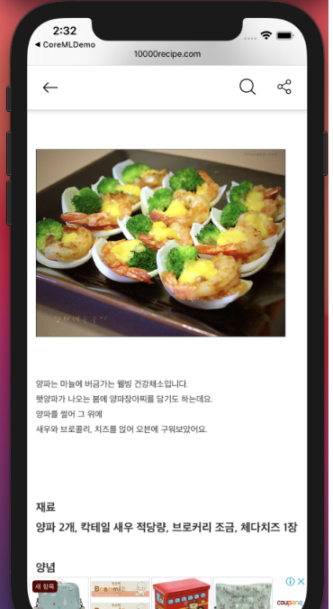

# 이미지 분류 모델 레시피 어플리케이션[CRA]
### CoreML Recipe Application
  
## 프로젝트 요약
> 2022.10.12 - 2023.12.07 

> **Model Classification & IOS Developer**   
* 양파, 토마토 이미지를 모델화하여 이미지에 맞는 레시피를 가져오도록 기획하였습니다.
* 모델 분류 작업이 끝난 후 토스트 메시지를 띄우는 것 동시에 레시피 뷰(리스트 뷰)를 팝업시킵니다.
* 레시피에 대한 더 자세한 설명이나 영상을 보고 싶다면 레시피 상세 설명 하단 버튼을 누르면 원본 자료로 이동합니다. 

## 담당 역할
### 이미지 모델 분류, ImagePicker 화면 구성
 
* CoreML의 CreateML을 사용하여 토마토, 양파 이미지 30개를 학습시켜 모델화 작업 진행
* CreateML을  

## 시연영상

